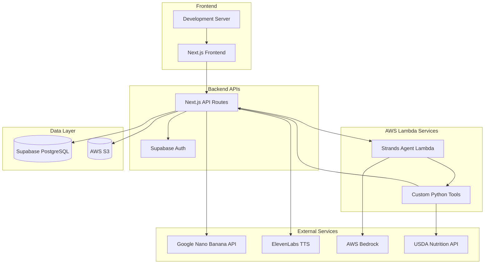

# Design Document

## Overview

Food Lens MVP is a containerized Next.js application that enables restaurants to upload menus and automatically generate high-quality food images using AI. The platform integrates AWS Strands Agent for intelligent food advisory and ElevenLabs for voice synthesis, providing an engaging customer experience. The system is designed for real-time development with hot reloading and deployed on AWS App Runner for scalability.

## Architecture

### High-Level Architecture



### System Flow

1. **Restaurant Onboarding**: Supabase Auth → Restaurant Profile Creation
2. **Menu Management**: CRUD operations via Next.js API → Supabase Database
3. **Image Generation**: Menu Item Creation → Google Nano Banana API → AWS S3 Storage
4. **AI Food Advisory**: User Query → Next.js API → AWS Lambda (Strands Agent) → Custom Tools → Response
5. **Voice Synthesis**: Text Response → ElevenLabs TTS → Audio Playback

## Components and Interfaces

### Frontend Components

#### Core Pages
- **Landing Page** (`/`): Marketing and authentication entry point
- **Restaurant Dashboard** (`/dashboard`): Menu management interface
- **Menu View** (`/menu/[restaurantId]`): Customer-facing menu display
- **AI Chat Interface** (`/menu/[restaurantId]/chat`): Food advisory interaction

#### Reusable Components
- **MenuItemCard**: Displays menu item with generated image, price, and details
- **ChatInterface**: AI conversation UI with voice playback controls
- **ImageUploadFallback**: Handles image generation states and fallbacks
- **AuthGuard**: Protects restaurant-only routes

### Backend API Endpoints

#### Authentication & Restaurant Management
```typescript
// /api/auth/signup
POST: { email: string, password: string, restaurantName: string }
Response: { user: User, restaurant: Restaurant }

// /api/restaurants/profile
GET: Restaurant profile data
PUT: Update restaurant information
```

#### Menu Management
```typescript
// /api/menu
POST: { name: string, price: number, ingredients?: string[], description?: string }
Response: { menuItem: MenuItem, imageGenerationStatus: string }

GET: { restaurantId: string }
Response: { menuItems: MenuItem[] }

// /api/menu/[itemId]
PUT: Update menu item
DELETE: Remove menu item and associated S3 images
```

#### AI & Voice Services
```typescript
// /api/ai/query
POST: { 
  query: string, 
  dishContext?: { itemId: string, name: string },
  restaurantId: string 
}
Response: { 
  textResponse: string, 
  audioUrl?: string,
  nutritionData?: NutritionInfo 
}

// Internal Lambda invocation (not direct API)
// AWS Lambda Function: food-lens-strands-agent
Payload: {
  prompt: string,
  context: {
    restaurantId: string,
    dishId?: string,
    menuApiEndpoint: string
  }
}
Response: {
  response: string,
  nutritionData?: object
}
```

### AWS Lambda Strands Agent Design

#### Lambda Function Structure
```
lambda/
├── agent_handler.py          # Main Lambda handler
├── tools/
│   ├── __init__.py
│   ├── dish_info.py         # Get dish information tool
│   ├── nutrition_lookup.py  # USDA nutrition API tool
│   └── dietary_advice.py    # Dietary guidance tool
├── requirements.txt         # Python dependencies
└── config.py               # Configuration and constants
```

#### Agent Configuration
```python
# lambda/agent_handler.py
from strands import Agent
from tools.dish_info import get_dish_info
from tools.nutrition_lookup import nutrition_lookup
from tools.dietary_advice import dietary_advice

FOOD_ADVISOR_SYSTEM_PROMPT = """You are a friendly food advisor for Food Lens restaurants. You help customers understand menu items, provide nutritional information, and offer dietary guidance.

When responding:
- Be concise and friendly
- Include nutritional information when available
- Always include medical disclaimers for health/allergy questions
- Format responses for voice synthesis (avoid special characters)
- Focus on the specific restaurant's menu items

Available tools:
- get_dish_info: Get detailed information about specific menu items
- nutrition_lookup: Get nutritional data from USDA database
- dietary_advice: Provide dietary guidance with disclaimers
"""

def handler(event, context):
    agent = Agent(
        system_prompt=FOOD_ADVISOR_SYSTEM_PROMPT,
        tools=[get_dish_info, nutrition_lookup, dietary_advice],
    )
    
    prompt = event.get('prompt')
    restaurant_context = event.get('context', {})
    
    # Add context to prompt if available
    if restaurant_context.get('dishId'):
        prompt = f"Context: Restaurant ID {restaurant_context['restaurantId']}, Dish ID {restaurant_context['dishId']}. Query: {prompt}"
    
    response = agent(prompt)
    return {
        'response': str(response),
        'context': restaurant_context
    }
```

#### Custom Tools Implementation
```python
# tools/dish_info.py
@tool
async def get_dish_info(dish_id: str, restaurant_id: str) -> dict:
    """Fetch detailed menu item information from Food Lens API."""
    import httpx
    import os
    
    api_endpoint = os.environ.get('FOOD_LENS_API_ENDPOINT')
    api_key = os.environ.get('FOOD_LENS_API_KEY')
    
    async with httpx.AsyncClient() as client:
        response = await client.get(
            f"{api_endpoint}/api/menu/{dish_id}",
            headers={"Authorization": f"Bearer {api_key}"},
            params={"restaurant_id": restaurant_id}
        )
        return response.json()

# tools/nutrition_lookup.py
@tool
async def nutrition_lookup(food_name: str, ingredients: list = None) -> dict:
    """Get nutritional information using USDA FoodData Central API."""
    import httpx
    import os
    
    usda_api_key = os.environ.get('USDA_API_KEY')
    
    async with httpx.AsyncClient() as client:
        response = await client.get(
            "https://api.nal.usda.gov/fdc/v1/foods/search",
            params={
                "query": food_name,
                "api_key": usda_api_key,
                "pageSize": 1
            }
        )
        return response.json()

# tools/dietary_advice.py
@tool
async def dietary_advice(query: str, dietary_restrictions: list = None) -> str:
    """Provide dietary guidance with appropriate medical disclaimers."""
    disclaimer = "⚠️ This is general information only. Consult healthcare providers for medical advice."
    
    # Process dietary guidance logic here
    advice = f"Based on your query about {query}, here's some general guidance... {disclaimer}"
    return advice
```

#### Lambda Deployment Configuration
```python
# CDK deployment configuration
lambda_function = aws_lambda.Function(
    self, "FoodLensStrandsAgent",
    runtime=aws_lambda.Runtime.PYTHON_3_12,
    handler="agent_handler.handler",
    code=aws_lambda.Code.from_asset("lambda"),
    timeout=Duration.seconds(30),
    memory_size=512,
    environment={
        "FOOD_LENS_API_ENDPOINT": food_lens_api_endpoint,
        "USDA_API_KEY": usda_api_key,
    },
    layers=[dependencies_layer]
)

# Add Bedrock permissions
lambda_function.add_to_role_policy(
    aws_iam.PolicyStatement(
        actions=["bedrock:InvokeModel", "bedrock:InvokeModelWithResponseStream"],
        resources=["*"]
    )
)
```

## Data Models

### Database Schema (Supabase)

```sql
-- Restaurants table
CREATE TABLE restaurants (
    id UUID PRIMARY KEY DEFAULT gen_random_uuid(),
    name TEXT NOT NULL,
    email TEXT UNIQUE NOT NULL,
    created_at TIMESTAMP WITH TIME ZONE DEFAULT NOW(),
    updated_at TIMESTAMP WITH TIME ZONE DEFAULT NOW()
);

-- Menu items table
CREATE TABLE menu_items (
    id UUID PRIMARY KEY DEFAULT gen_random_uuid(),
    restaurant_id UUID REFERENCES restaurants(id) ON DELETE CASCADE,
    name TEXT NOT NULL,
    price DECIMAL(10,2) NOT NULL,
    ingredients TEXT[],
    description TEXT,
    image_url TEXT,
    image_generation_status TEXT DEFAULT 'pending',
    created_at TIMESTAMP WITH TIME ZONE DEFAULT NOW(),
    updated_at TIMESTAMP WITH TIME ZONE DEFAULT NOW()
);

-- Row Level Security
ALTER TABLE restaurants ENABLE ROW LEVEL SECURITY;
ALTER TABLE menu_items ENABLE ROW LEVEL SECURITY;

-- RLS Policies
CREATE POLICY "Restaurants can only see their own data" ON restaurants
    FOR ALL USING (auth.uid()::text = email);

CREATE POLICY "Restaurants can only manage their menu items" ON menu_items
    FOR ALL USING (
        restaurant_id IN (
            SELECT id FROM restaurants WHERE email = auth.uid()::text
        )
    );
```

### TypeScript Interfaces

```typescript
interface Restaurant {
  id: string;
  name: string;
  email: string;
  created_at: string;
  updated_at: string;
}

interface MenuItem {
  id: string;
  restaurant_id: string;
  name: string;
  price: number;
  ingredients?: string[];
  description?: string;
  image_url?: string;
  image_generation_status: 'pending' | 'generating' | 'completed' | 'failed';
  created_at: string;
  updated_at: string;
}

interface AIQueryRequest {
  query: string;
  dishContext?: {
    itemId: string;
    name: string;
  };
  restaurantId: string;
}

interface AIQueryResponse {
  textResponse: string;
  audioUrl?: string;
  nutritionData?: NutritionInfo;
}
```

## Error Handling

### Frontend Error Handling
- **Network Errors**: Retry mechanisms with exponential backoff
- **Authentication Errors**: Automatic redirect to login with context preservation
- **Image Loading Errors**: Graceful fallback to placeholder images
- **Voice Playback Errors**: Silent fallback to text-only responses

### Backend Error Handling
- **External API Failures**: Graceful degradation without blocking core functionality
- **Database Connection Issues**: Connection pooling and retry logic
- **Image Generation Failures**: Status tracking and manual retry options
- **Validation Errors**: Comprehensive input sanitization and error messages

### AWS Strands Agent Error Handling
- **Tool Execution Failures**: Fallback responses with error context
- **API Rate Limiting**: Queuing and retry mechanisms
- **Nutrition Data Unavailable**: Clear messaging about data limitations
- **Medical Disclaimers**: Automatic inclusion for health-related queries

## Testing Strategy

### Development Testing
- **Hot Reloading**: Immediate feedback for frontend and API changes
- **Mock Services**: Development-time mocks for external APIs
- **Database Seeding**: Consistent test data for development
- **Error Simulation**: Toggle switches for testing error scenarios

### Unit Testing (Optional)
- **API Route Testing**: Request/response validation
- **Component Testing**: React component behavior
- **Utility Function Testing**: Data transformation and validation
- **Agent Tool Testing**: Individual tool functionality

### Integration Testing (Optional)
- **End-to-End Workflows**: Complete user journeys
- **External API Integration**: Service connectivity and response handling
- **Database Operations**: CRUD operations and RLS policies
- **Authentication Flows**: Login, signup, and session management

### Performance Considerations
- **Image Optimization**: Next.js Image component with S3 CDN
- **API Response Caching**: Strategic caching for menu data
- **Database Query Optimization**: Indexed queries and connection pooling
- **Lazy Loading**: Progressive loading of menu items and images

## Security Implementation

### Authentication & Authorization
- **Supabase Auth**: JWT-based authentication with secure session management
- **Row Level Security**: Database-level isolation between restaurants
- **API Route Protection**: Middleware for authenticated endpoints
- **CORS Configuration**: Restricted origins for production deployment

### Data Protection
- **Input Sanitization**: Comprehensive validation for all user inputs
- **SQL Injection Prevention**: Parameterized queries via Supabase client
- **XSS Protection**: Content Security Policy and input encoding
- **Environment Variables**: Secure storage of API keys and secrets

### External Service Security
- **API Key Management**: AWS Secrets Manager for production keys
- **Rate Limiting**: Protection against API abuse
- **Signed URLs**: Secure S3 access with expiration
- **HTTPS Enforcement**: SSL/TLS for all external communications

## Deployment Architecture

### Development Environment
- **Next.js Dev Server**: Hot reloading on `localhost:3000`
- **Local Database**: Supabase local development setup
- **Environment Variables**: `.env.local` for development keys
- **Mock Services**: Local implementations of external APIs

### Production Deployment
- **AWS App Runner**: Containerized deployment with auto-scaling
- **Docker Configuration**: Multi-stage build for optimized images
- **Environment Management**: AWS Secrets Manager integration
- **Monitoring**: CloudWatch logs and metrics with Sentry error tracking

### CI/CD Pipeline
- **GitHub Actions**: Automated testing and deployment
- **Container Registry**: AWS ECR for Docker image storage
- **Blue-Green Deployment**: Zero-downtime updates via App Runner
- **Health Checks**: Application and database connectivity monitoring